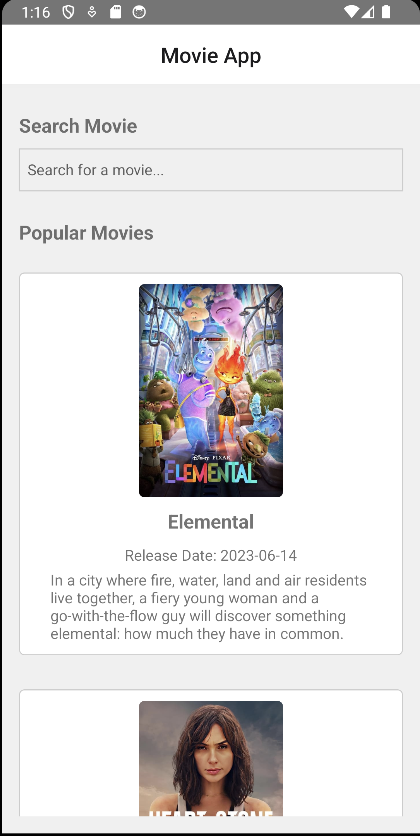

# Movie App
I have created this Movie App to show list of movies and there is an option to search movies as well. To get data I have register for an API key from TMDb (https://www.themoviedb.org/documentation/api).

## To run the Project follow below steps
1. First of all clone the repo on your local.
2. Go to the folder in terminal where you have cloned the project.
3. In terminal run this command "npx react-native start".

